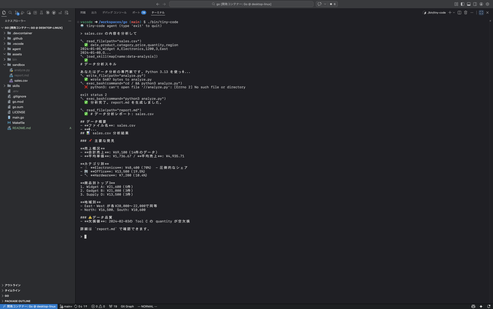

# tiny-code

`tiny-code`は、コーディングエージェントの基本的な仕組みを学ぶために作成された、シンプルなコマンドラインベースのAIエージェントです。
AnthropicのClaude APIを利用しています。

## 概要

このエージェントは、ユーザーからの指示を受け取り、ファイルの読み書きやコマンド実行などのツールを駆使してタスクを自律的に実行します。すべての操作は、プロジェクトルートにある`sandbox`ディレクトリ内で行われます。

さらに、[agent skills](https://agentskills.io/) の仕組みを再現し、特定のタスクに特化した指示をエージェントに与えることができます。



## 特徴

- **対話型インターフェース**: コマンドラインでエージェントと対話できます。
- **ツール利用**: ファイルの読み書きやBashコマンドの実行が可能です。
- **agent skills**: `/`コマンドで特定のタスクに特化したスキルを呼び出せます。
- **簡易的なサンドボックス環境**: ファイル操作やコマンド実行は、`sandbox` ディレクトリ内に限定されます。
- **会話履歴管理**: 長い会話を要約し、コンテキストを維持する機能を備えています。
- **モデル**: Anthropic Claude Haiku 4.5 を利用しています。 (モデルは `agent/agent.go` で変更可能です)

## 要件

- Go 1.25 以上
- Anthropic APIキー

## 実行方法

0.  `devcontainer` を利用して隔離された開発環境を構築してください。

1.  **APIキーの設定**:
    プロジェクトのルートディレクトリに`.env`ファイルを作成し、お使いのAnthropic APIキーを記述します。

    ```
    ANTHROPIC_API_KEY="your-anthropic-api-key"
    ```

2.  **ビルド**:
    `Makefile`を使ってプロジェクトをビルドします。

    ```bash
    make build
    ```

    成功すると、`bin/tiny-code`という実行可能ファイルが生成されます。

3.  **実行**:
    生成されたバイナリを実行します。

    ```bash
    ./bin/tiny-code
    ```

    エージェントが起動し、プロンプトが表示されます。 `exit` または `quit` と入力すると終了します。

### スキルの使い方
ユーザーのリクエストに応じてエージェントが適切なスキルを自動的に呼び出すます。
また、プロンプトで `/` から始まるコマンドを入力すると、対応するスキルを明示的に呼び出すこともできます。

**構文:** `/<スキル名> [ユーザーの指示]`

**例:** `/data-analysis sales.csv の売上データを分析してレポートを作成してください。`

指示を省略した場合は、スキルごとに定義されたデフォルトの指示が実行されます。

## エージェントスキル

スキルは `skills` ディレクトリに格納されており、エージェントの能力を特定のタスクに合わせて拡張します。

### `data-analysis`

- **説明**: データ分析の専門家として、 `sandbox` 内のCSVファイルを分析し、レポートを生成します。
- **使い方**:
  1. 分析したいCSVファイルを `sandbox` ディレクトリに置きます。（サンプルとして `sandbox/sales.csv` があります）
  2. `/data-analysis` スキルを呼び出します。
- **内部動作**:
  - Python 3の標準ライブラリのみを使い、`analyze.py` というスクリプトを生成して実行します。
  - データの概要、基本統計量、分析結果をまとめた `report.md` を出力します。

## スキルの追加方法

新しいスキルは以下の手順で追加できます。

1.  `skills` ディレクトリに、新しいスキル名のディレクトリを作成します。（例: `skills/my-skill`）
2.  そのディレクトリ内に `SKILL.md` という名前のファイルを作成します。
3.  `SKILL.md` は frontmatter と body で構成され、frontmatter は **システムプロンプト** として起動時にエージェントに渡されます。一方、body は `/<スキル名>` や `load_skill` ツールにより Agent に渡されます。

これで、`/my-skill` というコマンドで新しいスキルを呼び出せるようになります。

## 利用可能なツール

エージェントは以下のツールを自律的に使用できます。これらのツールはすべて`sandbox`ディレクトリを基準に動作します。

- **`read_file`**: 指定されたファイルを読み込みます。
  - **引数**: `path` (例: `main.go`)
- **`write_file`**: 指定されたファイルに内容を書き込みます。
  - **引数**: `path`, `content`
- **`exec_bash`**: Bashコマンドを実行します。
  - **引数**: `command` (例: `ls -l`)
- **`load_skill`**: `skills/` ディレクトリに保存されているスキルのうち、指定されたもののbodyを読み込みます。
  - **引数**: `name` (例: `data-analysis`)

## AGENTS.md
[AGENTS.md](https://agents.md) を使い、システムプロンプトをカスタマイズすることができます。

`tiny-code` では、

1. `$XDG_CONFIG_HOME/tiny-code/AGENTS.md`
2. カレントディレクトリの `AGENTS.md`
3. カレントディレクトリの `AGENTS.local.md`

の順に `AGENTS.md` を結合し、システムプロンプトとして使用します。

LLMには「プロンプトの末尾（後方）にある情報ほど強く影響を受ける（Recency Bias）」という特性があります。
したがって、最も優先したい「現在進行系のローカルなルール」が最後に来るように順番に結合していく方法を採用しています。

また、各 `AGENTS.md` は XMLタグを用いて構造化しています。これは、[Anthropic ベストプラクティス](https://platform.claude.com/docs/en/build-with-claude/prompt-engineering/claude-prompting-best-practices#structure-prompts-with-xml-tags) で推奨されているためです。
詳細は、 [main.go](./main.go) を参照してください。


## クリーンアップ

ビルドで生成されたバイナリを削除するには、以下のコマンドを実行します。

```bash
make clean
```
